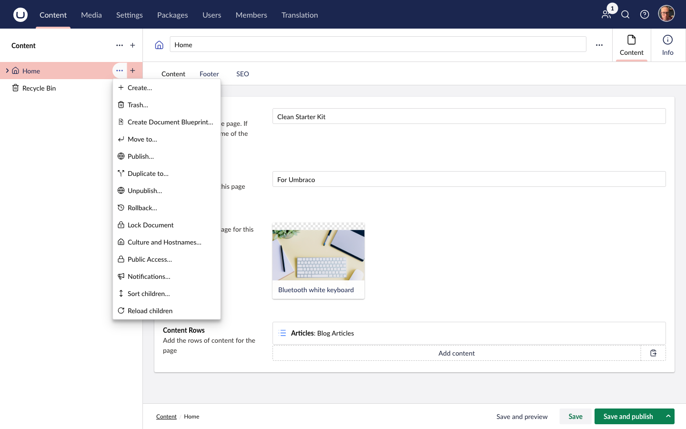
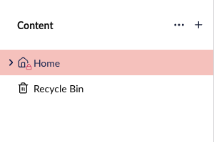
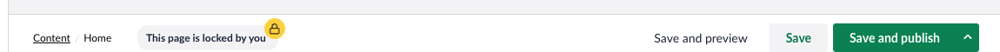
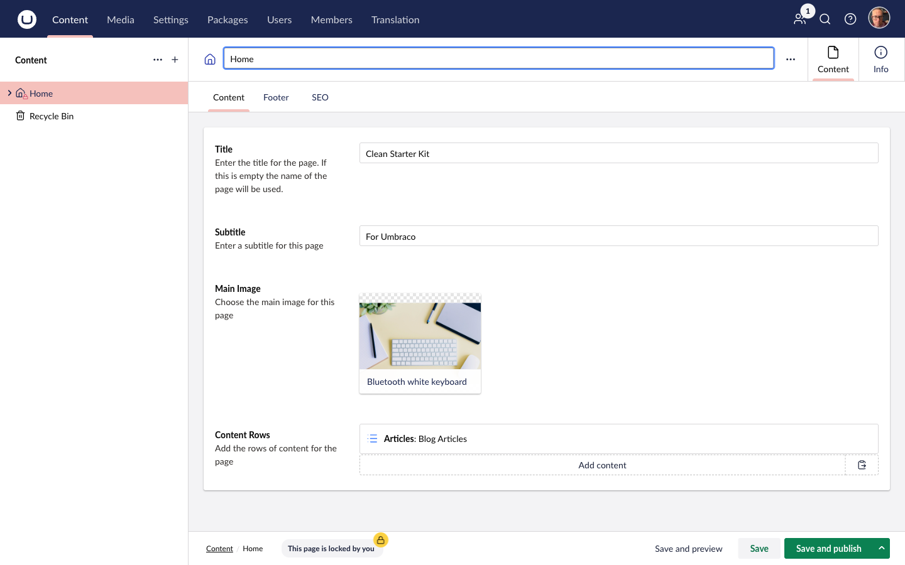

Content locking is the core feature of ContentLock. It prevents multiple editors from inadvertently overwriting each other's work by making a content node read-only for everyone except the editor who holds the lock.

---

## Locking a Node

There are two ways to lock a content node:

**Via the tree context menu:**
Right-click any content node in the Content tree → click **Lock**.

**Via the workspace actions menu:**
Open the content node → click the **⋮** (more actions) button in the top-right → click **Lock** under the *Content Lock* category.

The lock is applied immediately and broadcast to all connected editors via SignalR.

:::note
The **Lock** action is only shown if the node is not already locked. If the node is already locked by you or someone else, you will see the **Unlock** action instead (subject to permissions).
:::

---

## What Happens When a Node is Locked

### Visual indicators

- A **lock icon** appears on the node in the Content tree.
- A **footer banner** at the bottom of the workspace displays who holds the lock.
  - If you hold the lock: *"This page is locked by you"*
  - If someone else holds the lock: *"This page is locked by [Name]"*

### Read-only properties

All content properties become disabled for users who do not hold the lock. Fields cannot be typed into or changed.

### Hidden actions

The following actions are hidden from the workspace actions bar for users who do not hold the lock:

- Save
- Save and Publish
- Publish
- Unpublish
- Move To
- Duplicate To
- Rollback
- Move to Recycle Bin
- Delete

This prevents any accidental saves or publishes while another editor is working.

---

## Unlocking a Node

**If you hold the lock:**
Right-click the node in the tree → **Unlock**, or use the workspace **⋮** actions menu → **Unlock**.

**If you have the Unlocker permission:**
You can unlock any node, regardless of who locked it. See [Permissions](/permissions/index/) for details.

The unlock is broadcast to all connected editors instantly — the node becomes editable for everyone again.

---

## Automatic Unlock

Nodes are automatically unlocked in the following situations:

- **Content deleted** — when a locked node is permanently deleted, the lock is removed.
- **Moved to Recycle Bin** — when a locked node is trashed, the lock is removed.

:::caution
If a user who does *not* hold the lock tries to delete a locked node, the operation is **cancelled** and an error is shown. Only the lock holder or a user with the Unlocker permission can delete a locked node.
:::

---

## Real-Time Updates

ContentLock uses SignalR to push lock state changes to every active backoffice session instantly. If Editor A locks a node while Editor B is viewing it, Editor B's screen updates immediately — no page refresh needed.

---

## Audit Trail

Every lock and unlock action is recorded in Umbraco's built-in **audit log**. To view the history for a specific node:

1. Open the content node.
2. Click the **Info** tab (ⓘ) in the workspace.
3. Scroll to the **History** section.

You will see entries for each lock and unlock event, including which user performed the action and when.

---

## Screenshots

