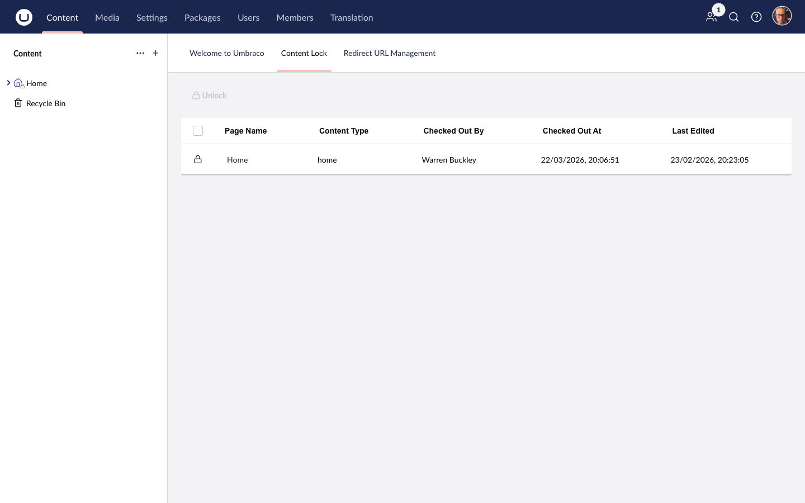

import { Badge } from '@astrojs/starlight/components';

<Badge text="Added in 17.0.0" variant="success" size="small" />

The ContentLock dashboard gives administrators and editors with the Unlocker permission a birds-eye view of all currently locked content nodes across the entire site.

---

## Accessing the Dashboard

1. Navigate to the **Content** section in the Umbraco backoffice.
2. Click the **Content Lock** tab in the section header (next to Content, Media, etc.).

---

## Dashboard Columns

The dashboard displays a table with the following columns:

| Column | Description |
|---|---|
| **Page Name** | The name of the locked content node, linking directly to it |
| **Content Type** | The document type / content type alias |
| **Checked Out By** | The name of the user who holds the lock |
| **Checked Out At** | Date and time when the lock was applied |
| **Last Edited** | Date and time of the last edit to the node |

If no nodes are currently locked, the dashboard shows an empty state: *"No locks — 🎉 Zip, zero, nada"*.

---

## Single Unlock

To unlock an individual node from the dashboard:

1. Find the row for the locked node.
2. Click the **Unlock** button in the row.

The lock is released immediately and removed from the table. The change is broadcast to all connected editors via SignalR.

:::note
You can only unlock nodes that you locked yourself, unless you have the `ContentLock.Unlocker` permission. See [Permissions](/permissions/index/).
:::

---

## Bulk Unlock

Bulk unlock lets you release multiple locks at once — useful after a deployment, content freeze, or when cleaning up stale locks from editors who have left.

**Requires the `ContentLock.Unlocker` permission.**

1. Tick the checkboxes next to the nodes you want to unlock (or select all).
2. Click the **Bulk Unlock** button.
3. All selected locks are released in a single operation.

A toast notification confirms: *"The selected content has been unlocked successfully"*.

---

## Screenshot

