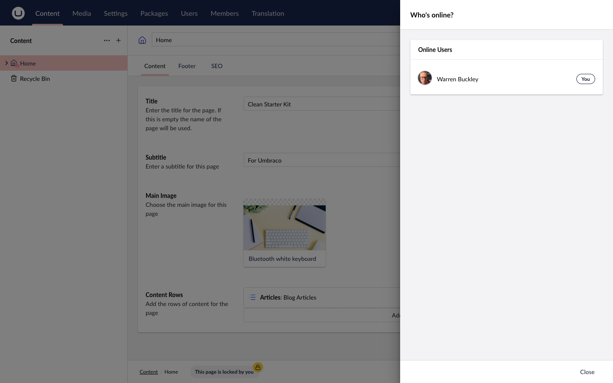

import { Badge } from '@astrojs/starlight/components';

<Badge text="Added in 17.0.0" variant="success" size="small" />

The Online Users feature lets backoffice editors see who else is currently active, making it easier to coordinate content work and avoid conflicts before they happen.

---

## Header App

When Online Users is enabled, a **user count indicator** appears in the top bar of the Umbraco backoffice (the header app area, alongside any other header apps).

- The count shows the number of **other** active editors (not counting yourself).
- The indicator updates in real-time as editors connect or disconnect.
- If no other editors are online, the indicator is hidden (or shows 0).

---

## Online Users Modal

Clicking the header app opens the **"Who's online?"** modal, which lists every currently active backoffice user by name.

- Your own name is marked with a **(You)** label.
- Other users are listed with their display names.
- If the [Audio Calling](/features/audio-calling/) feature is enabled, each user has a **Call** button next to their name (or a **"On a call"** indicator if they are already in a call).

---

## Sound Notifications

When sound notifications are enabled, ContentLock plays audio cues when editors connect or disconnect:

- **Login sound** — plays when a new editor connects to the backoffice.
- **Logout sound** — plays when an editor disconnects (closes the tab or logs out).

The default sounds are bundled with the package. You can replace them with your own files via configuration — see [Online Users Configuration](/configuration/online-users/).

---

## Enabling / Disabling

Online Users can be toggled on or off **without restarting the application**. When you change `OnlineUsers.Enable` in `appsettings.json`, the setting is pushed to all connected clients via SignalR and takes effect immediately.

```json
{
  "ContentLock": {
    "OnlineUsers": {
      "Enable": false
    }
  }
}
```

When disabled, the header app count and the online users modal are hidden for all editors.

---

## Screenshots




---

## Related

- [Audio Calling](/features/audio-calling/) — make voice calls to online editors
- [Online Users Configuration](/configuration/online-users/) — sounds, custom audio files
